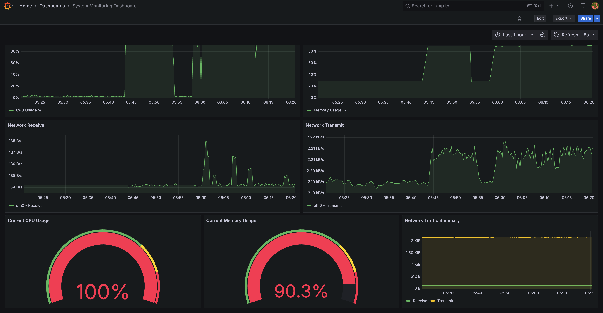

<div align="center">

# 🚀 TalentMesh

<h3>Next-Generation Interview as a Service Platform</h3>


### Explore Our Wiki, API Docs, and Project Management Tools!

[](https://github.com/Learnathon-By-Geeky-Solutions/earendel/wiki)
[](http://173.249.54.173/swagger/index.html)
[](https://github.com/orgs/Learnathon-By-Geeky-Solutions/projects/91/views/1)
[](https://github.com/orgs/Learnathon-By-Geeky-Solutions/projects/91/views/7)
[](https://github.com/Learnathon-By-Geeky-Solutions/earendel/tree/development?tab=License-1-ov-file)

### Tech Stack

[](https://dotnet.microsoft.com/download)
[](https://angular.io)
[](https://www.postgresql.org/)
[](https://www.docker.com/)
[](https://nginx.org/)
[](#grafana)
[](https://prometheus.io/)
[](#rabbitmq)
[](#aspire)
[](#hangfire)

<br>

<p align="center"> <a href="https://sonarcloud.io/summary/new_code?id=Learnathon-By-Geeky-Solutions_earendel">  </a> </p>

<!-- SonarCloud Badges - Organized in a borderless table -->

<table style="border: none; border-collapse: collapse;">
 <tr style="border: none;"> 
 <td style="border: none; padding: 5px;"> <a href="https://sonarcloud.io/summary/new_code?id=Learnathon-By-Geeky-Solutions_earendel">  </a> </td> 
 <td style="border: none; padding: 5px;"> <a href="https://sonarcloud.io/summary/new_code?id=Learnathon-By-Geeky-Solutions_earendel">  </a> </td> 
 
 <td style="border: none; padding: 5px;"> <a href="https://sonarcloud.io/summary/new_code?id=Learnathon-By-Geeky-Solutions_earendel">  </a> </td>
  <td style="border: none; padding: 5px;"> <a href="https://sonarcloud.io/summary/new_code?id=Learnathon-By-Geeky-Solutions_earendel">  </a> </td> 
 
  </tr>

 <tr style="border: none;"> 
 <td style="border: none; padding: 5px;"> <a href="https://sonarcloud.io/summary/new_code?id=Learnathon-By-Geeky-Solutions_earendel">  </a> </td> 
 <td style="border: none; padding: 5px;"> <a href="https://sonarcloud.io/summary/new_code?id=Learnathon-By-Geeky-Solutions_earendel">  </a> </td> <td style="border: none; padding: 5px;"> <a href="https://sonarcloud.io/summary/new_code?id=Learnathon-By-Geeky-Solutions_earendel">  </a> </td> 
 <td style="border: none; padding: 5px;"> <a href="https://sonarcloud.io/summary/new_code?id=Learnathon-By-Geeky-Solutions_earendel">  </a> </td> 
 </tr>
</table>

</div>

<div align="center">

  <h2>🔥 Meet Team - <b>Earendel</b></h2>

  <table style="width: 90%;">
    <tr>
      <td align="center" width="24%">
        <h4>Rakibul Hasan</h4>
         
        <br> <a href="https://github.com/rakibul24466" target="_blank">
              
             </a>
      </td>
      <td style="min-width: 220px;"  align="center" width="30%">
          <h4 style="white-space: nowrap; font-size: 16px; padding: 0 5px;">Nafiul Hasan Hamim</h4>
            
        <br><a href="https://github.com/nafiulhasanhamim" target="_blank">
              
             </a>
      </td>
      <td align="center" width="25%">
        <h4>MFR Siam</h4>
         
        <br><a href="https://github.com/MFRSiam" target="_blank">
              
             </a>
      </td>
      <td align="center" width="20%">
        <h4>Mahmudul Hasan</h4>
         
    </tr>
  </table>

</div>

---

# 🤖 About TalentMesh

<table>
<tr>
<td>
 
Welcome to the <b>TalentMesh</b> GitHub Repo!

TalentMesh is a next-generation **Interview as a Service (IaaS)** platform designed to streamline technical hiring. Our platform helps companies conduct **standardized, scalable, and efficient** interviews by providing a seamless experience for both interviewers and candidates.

## 🔥 Why TalentMesh?

Traditional hiring processes come with several challenges:  
✅ **Fragmented evaluations** – Assessments often lack standardization, leading to inconsistent results.  
✅ **Scheduling delays** – Coordinating interviews can be time-consuming and inefficient.  
✅ **Interviewer burnout** – Companies struggle with interviewer availability and bandwidth.  
✅ **Candidate drop-offs** – Lengthy hiring cycles increase the risk of losing top talent.

TalentMesh **solves these problems** by offering an **on-demand interview outsourcing platform**, ensuring:  
🔹 Faster interview scheduling  
🔹 High-quality and standardized evaluations  
🔹 A pay-per-interview pricing model  
🔹 Real-time assessments with a collaborative coding environment  
🔹 **Reports** and detailed feedback are generated instantly.

## 🌍 Market Opportunity

- **The global recruitment outsourcing market** was valued at **$7.33 billion** in 2022 and is projected to grow at **16.1% CAGR** from 2023 to 2030.
- Companies are shifting towards **outsourced interview solutions** to cut costs and improve hiring efficiency.

## 💡 Key Benefits

- **Reduced time-to-hire** – Faster scheduling and instant reports eliminate hiring delays.
- **Cost-effective** – Pay-per-interview model ensures budget control for businesses.
- **Access to top interviewers** – A network of industry experts conducts interviews.
- **Comprehensive reporting** - Companies receive detailed insights to evaluate candidates effectively.

</td> 
</tr>
</table>

## 🏗 System Architecture


### 📌 User Flow Diagram


### 📌 ER Diagram


## 📊 Dashboards

We used various monitoring and visualization tools to track our system health and metrics:

<h4 id="grafana"> <b>Grafana</b> – Real-time application monitoring </h4> 
<table>
<tr>
<td>
   <a href="#grafana">
    
  </a>
</td>
 <td>
   <a href="http://173.249.54.173:3000/login">
    http://173.249.54.173:3000/login
  </a>
</td>
</tr>
</table>


<h4 id="prometheus"> <b>Prometheus</b> – Monitoring system & time series database </h4> 
<table>
<tr>
<td>
   <a href="#prometheus">
    
  </a>
</td>
 <td>
   <a href="http://173.249.54.173:9090/query?g0.expr=node_cpu_seconds_total&g0.show_tree=0&g0.tab=table&g0.range_input=1h&g0.res_type=auto&g0.res_density=medium&g0.display_mode=lines&g0.show_exemplars=0">
    http://173.249.54.173:9090/
  </a>
</td>
</tr>
</table>


<h4 id="aspire"> <b>Aspire</b> –  API and service management </h4> 


<h4 id="rabbitmq"> <b>RabbitMQ</b> – Queue management and message broker </h4>
<table>
<tr>
<td>
   <a href="#rabbitmq">
    
  </a>
</td>
 <td>
   <a href="http://173.249.54.173/rabbitmq/">
    http://173.249.54.173/rabbitmq/
  </a>
</td>
</tr>
</table>


<h4 id="hangfire"> <b>Hangfire</b> – Background Job Processing </h4>
<table>
<tr>
<td>
   <a href="#hangfire">
    
  </a>
</td>
 <td>
   <a href="http://173.249.54.173/jobs">
    http://173.249.54.173/jobs
  </a>
</td>
</tr>
</table>


---

## 🔀 Git Workflow Strategy

We follow **GitFlow** branching strategy to maintain code quality and streamline development.


---

## 📜 API Documentation

We provide a fully interactive **Swagger UI** for API testing and documentation.

[](http://173.249.54.173/swagger/index.html)

---

<div align="center">

# 🖥️ Talent Mesh Frontend

</div>

<div align="center">

While this repository only hosts our backend services. But for convenience, we have included all the dashboard link here to provide a quick glimpse of all dashboards:

|          Portal           |              Features               |                                  Quick Access                                  |
| :-----------------------: | :---------------------------------: | :----------------------------------------------------------------------------: |
| 👨‍💼 **Interviewer Portal** | AI-assisted interviews & scheduling |  [🔗 Launch](https://talent-mesh-frontend.netlify.app/interviewer-dashboard)   |
|  👨‍💻 **Candidate Portal**  | Interactive assessments & tracking  |   [🔗 Launch](https://talent-mesh-frontend.netlify.app/candidate-dashboard)    |
|    👑 **Admin Portal**    |     System control & analytics      | [🔗 Launch](https://talent-mesh-frontend.netlify.app/admin-dashboard/overview) |
|     🏢 **HR Portal**      |    Recruitment & talent pipeline    |  [🔗 Launch](https://talent-mesh-frontend.netlify.app/hr-dashboard/overview)   |

</div>

---

## 🛠 Technical Architecture

```yaml
Core Architecture:
  - Pattern: Modular Monolithic
  - Design: Clean Architecture, Multi-tenancy
  - Principles: SOLID

Modules:
  Identity:
    - Identity & Access Control
    - Profile Management
  Jobs:
    - Job Management
    - Candidate Application
  Interviewer:
    - Zoom SDK
    - Codeing Playground (Code Compiler)

Technology Stack:
  Framework: ASP.NET Core 8.0
  Database: PostgreSQL 15
  Caching: Redis
  Real-time: SignalR
  Analytics: Grafana, Prometheus, Hangfire, Aspire Dashboard

Development Practices:
  - Domain-Driven Design
  - CQRS Pattern
  - Event-Driven Architecture
```
